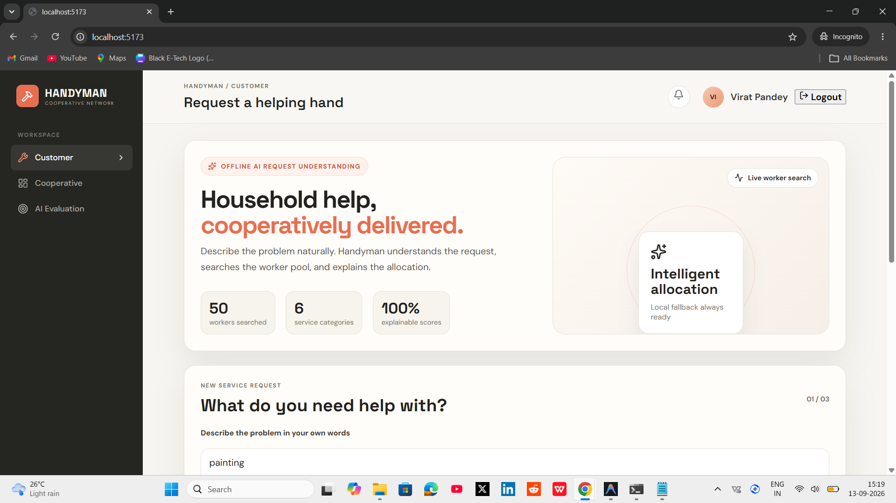
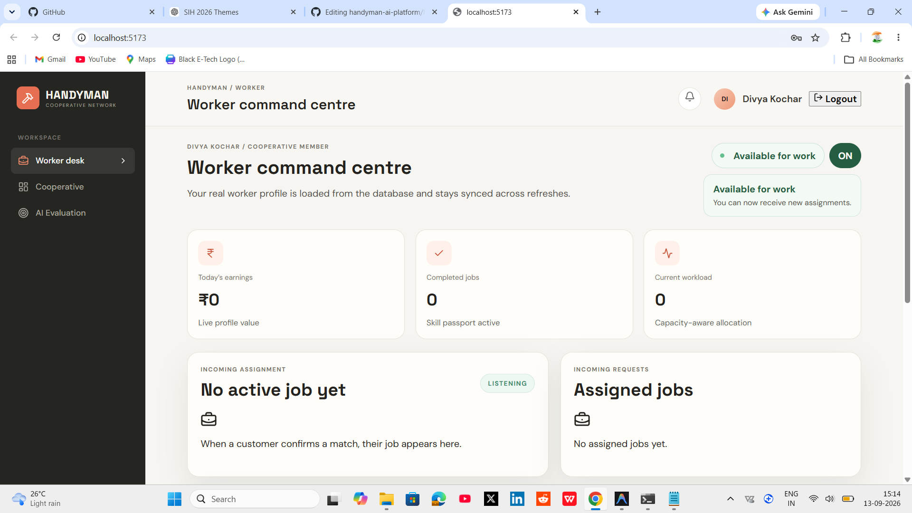
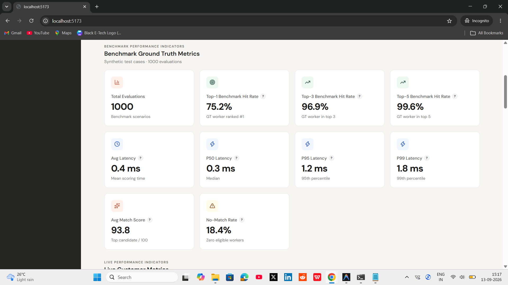
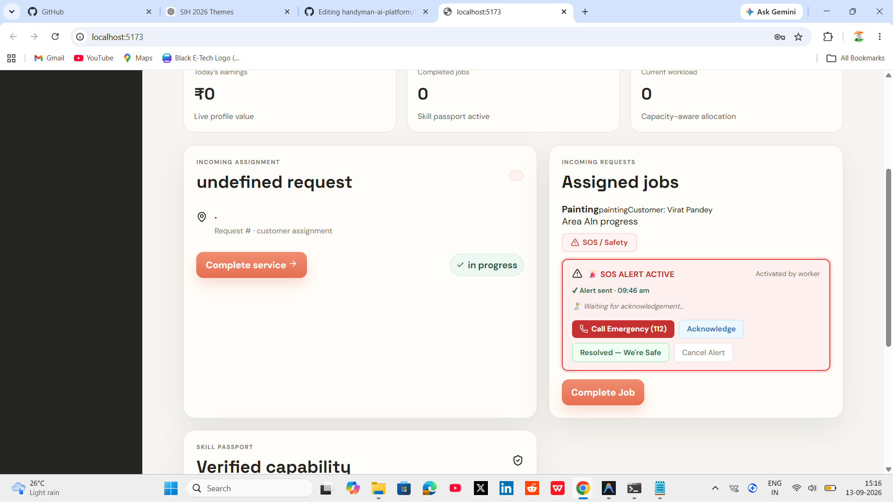
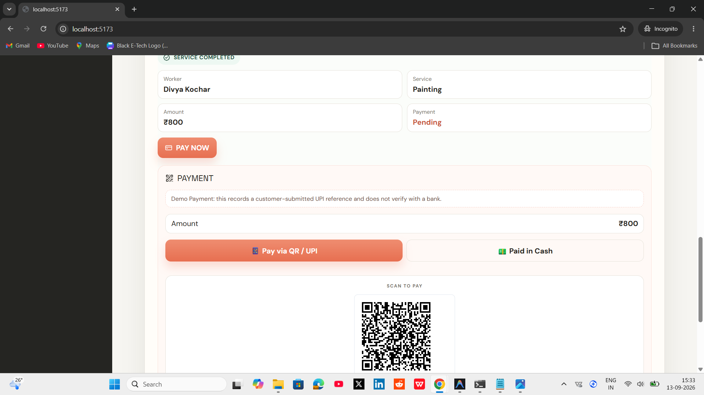

# Handyman

**Handyman** is a professional, full-stack cooperative service marketplace designed to connect households with verified service workers through an intelligent, explainable matching system.

## Overview
Handyman solves the problem of inefficient and unfair allocation of gig work. Instead of treating workers purely as algorithmically managed commodities, this platform operates as a cooperative network. It balances customer needs (urgency, distance, specific skills) with worker welfare (workload balance, fair opportunity, verified skills) to create a sustainable and equitable marketplace for household services.

## Key Features
- **AI-powered worker matching**: Intelligent recommendation engine matching service requests to the best available workers.
- **Worker/customer workflows**: Dedicated flows for request submission, acceptance, job execution, and rating.
- **Cooperative network**: Transparent earnings, skill passports, and workload balancing.
- **SOS emergency assistance**: Fast-tracked requests for urgent situations (e.g., severe plumbing leaks).
- **Payment system**: Integrated demo payment workflows using UPI QR codes.
- **AI Evaluation & Telemetry**: Built-in dashboard to monitor matching effectiveness and system metrics.
- **Reproducible AI benchmark**: A complete, offline suite to evaluate the matching engine deterministically.
- **Automated testing**: Comprehensive backend test suite ensuring system reliability.

## AI Matching System
The core of the platform is the Cooperative Intelligence Engine, which handles:
- **Candidate filtering**: Identifying available workers within the requested service area.
- **Worker eligibility**: Matching required skills against worker certifications and profiles.
- **Scoring/ranking**: Scoring candidates based on distance, skill match, urgency, workload fairness, and rating history.
- **Top-K recommendations**: Selecting the most appropriate workers for a given request.
- **Latency measurement**: Tracking the performance of the matching algorithm for optimization.
- **Evaluation telemetry**: Logging matching decisions and factors for transparency and continuous improvement.

## AI Evaluation & Benchmark

The Handyman platform implements a strict separation between **LIVE CUSTOMER EVALUATION** and the **REPRODUCIBLE BENCHMARK**.

### Reproducible Benchmark
The project includes a robust, reproducible benchmark designed to validate the matching engine. This benchmark uses the actual matching engine to process requests, but is entirely isolated from live customer data.

- **Methodology**: 1,000 deterministic synthetic scenarios generated with a fixed seed (Seed 42) and explicit ground-truth design.
- **Purpose**: Validates the retrieval and ranking algorithms under varied constraints (urgency, skill scarcity, distance).
- **Disclaimer**: These metrics reflect the engine's performance against synthetic ground-truth scenarios, not real-world customer acceptance decisions.

**Latest Verified Benchmark Results**:
- **Top-1 Hit Rate**: 75.2%
- **Top-3 Hit Rate**: 96.9%
- **Top-5 Hit Rate**: 99.6%
- **Average Match Score**: 93.8/100
- **Average Latency**: 0.5 ms
- **No-Match Rate**: 18.4%

## Tech Stack
- **Frontend**: React, Vite
- **Backend**: Python, FastAPI
- **Database**: SQLite (via SQLAlchemy)
- **Testing**: pytest

## Architecture

```text
Frontend (React/Vite)
         ↓
      REST API
         ↓
  Backend Services (FastAPI)
  ├── Matching Engine
  ├── Evaluation & Telemetry
  ├── SOS Emergency
  ├── Payments
  └── Cooperative Services
         ↓
  Database (SQLite/SQLAlchemy)
```

## Testing
The backend is fully tested to ensure stability and correctness across all core services (matching, evaluation, payments, and SOS workflows).

**Latest Test Run Results**:
- **Total tests**: 66
- **Passed**: 66
- **Failed**: 0
- **Skipped**: 0

## Running Locally

### 1. Clone the repository
```bash
git clone <your-repository-url>
cd Handyman
```

### 2. Backend Setup
Open a terminal and navigate to the backend directory:
```bash
cd backend
python -m venv venv
# Windows: venv\Scripts\activate
# Mac/Linux: source venv/bin/activate
pip install -r requirements.txt
```

### 3. Environment Configuration
Copy the `.env.example` file to create a `.env` file in the root directory:
```bash
cp .env.example .env
```
*(The backend will default to demo mode if no configuration is provided)*

### 4. Start Backend
```bash
# Still in the backend directory
python -m uvicorn app.main:app --reload
```

### 5. Frontend Setup
Open a second terminal and navigate to the frontend directory:
```bash
cd frontend
npm install
```

### 6. Start Frontend
```bash
npm run dev
```
Open `http://localhost:5173` in your browser.

## Screenshots

### Customer Dashboard


### Worker Dashboard


### AI Evaluation & Benchmark


### SOS


### Payment



# Project Highlights

- **End-to-End Delivery**: Complete full-stack architecture from React UI to SQLAlchemy models.
- **Algorithmic Complexity**: Implements a transparent, multi-factor scoring engine rather than relying only on keyword matching.
- **Engineering Practices**: Separation of concerns, environment-based configuration, API telemetry, and comprehensive automated testing.
- **Data-Driven Engineering**: Built-in deterministic benchmarking tooling to validate matching-engine changes against reproducible scenarios.
